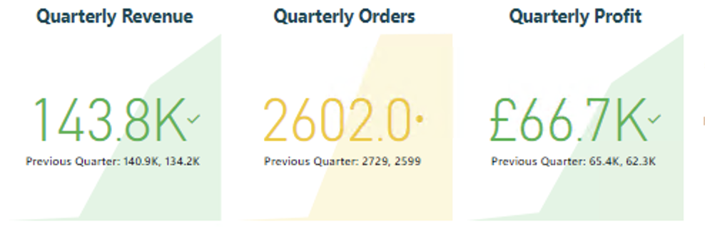

# data-analytics-power-bi-report357

## Contents
1. [Description](#description)
    - [Preparing and Transforming Data](#preparing-and-transforming-data)
        - [Orders Table Transformations](#orders-table-transformations)
        - [Customers table transformations](#customers-table-transformations)
    
    - [Data model and Measure creation](#data-model-and-measure-creation)
        - [Date Table](#date-table)
        - [Data Model](#data-model)
        - [Measures Table](#measures-table)
        - [Hierarchies](#hierarchies)
        - [Building the report](#building-the-report)
            - [Executive Summary](#executive-summary)
            - [Customer Page](#customer-page)
            - [Product Detail](#product-detail)
            - [Map Page](#map-page)
            - [Drill through page](#drill-through)
            - [Tooltips](#tooltips)
1. [Installation instructions](#installation-instructions)
1. [Usage instructions](#usage-instructions)
1. [File structure](#file-structure)
    - [AICore PowerBI Project CKnight.pbix](#aicore-powerbi-project-cknightpbix)
    - [SQl_Queries_and_csv_files](#sql_queries_and_csv_files)
1. [License information](#license-information)

## Description

In this project I connected to a variety of sources in order to retrieve the required datasets - this included:
- SQL Database (Source of the <i>Orders</i> table)
- Azure Blob Storage (Source of the <i>Stores</i> table)
- A folder of .csv files (Source of the <i>Customers</i> table)

The project was completed on a virtual windows machine runnning on Azure. This was connected to remotely on a Mac via the Microsoft Remote Desktop client

### Preparing and Transforming Data

### Orders table transformations

I transformed the data upon loading - ensuring columns were named in line with PowerBI conventions and data was cleaned. This was particularly the case on the 'Weight' column. This column included a mixture of numerical data (weight values) and the corresponding units: these included kg, g and oz amongst others. Additionally there were some weight values that corresponded to multipacks (i.e. 4 x 100g)

To split out the units from the numerical values, I used the 'Add Column from Examples' function to apply the multiple transformations required. This created the 'Weight Units' column. After this step, I filtered the column and replaced the 'multipack' values with their total weight (i.e. 4 x 100 became 400).

I then created a calculated column in this table that gave a kg value for the weight of the product. This required the following calculations: 
- <b>g &rarr; kg:</b> value in g  ÷ 1000
- <b>ml &rarr; kg</b> (assuming a similar density of that liquid to that of water): value in ml ÷ 1000 
- <b>ounces (oz) &rarr; kg:</b> value in ounces ÷ 35.274 

These transformations were wrapped into a nested IF statement where the required transformation was made based on the value of the unit in the 'Weight unit' column. 

### Customers table transformations

The columns were renamed in line with PowerBI conventions. The "Full Name" column was created by using the "First Name" and "Last Name" columns, merging the data in these with a space as a delimiter.

### Data model and Measure creation

### Date table

A date table was created by using the oldest data in the Orders table - the dates run from the 1st of January of the year of the first order (2010) and run through to the 31st December in the year with of the latest order. This was achieved with the following formula

Dates = CALENDAR(DATE(YEAR(MIN(Orders[Order_date]),1,1), DATE(YEAR(MAX(Orders[Order_date]),12,31))

The following columns were also added to the table using DAX formula

- Day of Week
- Month Number (i.e. Jan = 1, Dec = 12 etc.)
- Month Name
- Quarter
- Year
- Start of Year
- Start of Quarter
- Start of Month
- Start of Week

### Data model

A star schema data model was created with 'orders' as the central table 

<b>Data model</b> 

### Measures table

A measures table was created to capture the measures written for the report. These included the below examples to calculate TOTAL REVENUE, TOTAL PROFIT AND PREVIOUS QUARTER ORDERS amongst many others

 - Total Revenue = SUMX(Orders, Orders[Product Quantity] * RELATED(Products[Sale Price]))
 - Total Profit = SUMX(Products,Products[Sale Price]-Products[Cost Price])*RELATED([Product Quantity]))
 - Previous Quarter Orders = CALCULATE([Total Orders],PREVIOUSQUARTER(Dates[Date]))

The measures table also includes some measures written for display purposes in the report. For the card filter mentioned later in this file, the following formula was written in order to display the selected filters for a particular slicer (each separated by a comma followed by a space)

CONCATENATEX(ALLSELECTED(Products[Category]),Products[Category],", ")

A variant of this was also used to write a similar card for Store[Country] field.

### Hierarchies

Two hierarchies were created for the report - a "Geography" hierarchy for each store. A SWITCH formula was used to create a "Country" column in the table by allocating a country to the codes GB, US and DE (United Kingdom, United States and Germany respectively). These were already listed in a 'Country Code' column. A 'full geography' name for each row was created by concatenating the region and country for each store.

The hierarchy created for the Geography was as follows:
- World Region
- Country
- Country Region

A date hierarchy was also created using the following fields as levels

- Start of Year
- Start of Quarter
- Start of Month
- Start of Week
- Date

## Building the Report

### Executive Summary

This page includes a number of visuals:
- Revenue line chart with a forecast
- Two revenue donut charts
- Card visuals for Revenue, Profit and Orders
- Orders by product category bar chart
- KPI cards for quarterly Revenue, Profit and Orders: different selections shown below

### Customer Page

This page shows: 
- the customer trend (number of customers) within a line chart
- the Top 20 cusomters by Revenue (gold bars show relative % of revenue for that customer when compared to the top customer)
- Total customers per category bar chart
- Total customers by country donut chart
- Top customer detail card
- 'Revenue per customer' and 'Number of Unique Customers' card

### Product Detail

This page includes:
- Gauge visuals for quarterly targets for Revenue, Profit and Orders.
    - Target for each is a 5% increase on the value for the previous quarter

    Dax formulae examples

    Previous Quarter Orders = CALCULATE([Total Orders],PREVIOUSQUARTER(Dates[Date]))

    Orders Target = ([Previous Quarter Orders]*1.05)

- Scatter plot of profit per item versus order quantity to show high-selling and high-profit items (broken down by category)

- Area chart of Revenue by Start of Quarter and Cateogry (segmented by product category)

- Top 10 Products by Revenue (similar to Top Customers table)

This screenshot also shows the navigation bar present on the left hand side of each page 

The four icons on the bottom enable a user to navigate through to the separate sections in the report. Each icon turns blue upon hovering over.

This page also has a slicer side bar that pops out when clicking the slicer icon in the top left hand corner

Changing the selections in this side bar slices the visuals - the applied filters show up in the cards in the top left hand corner of the screen (the formulas written to achieve this are discussed in the [Measures table](#measures-table) section)

### Map page

### Drill through page

### Tooltips

## Installation instructions

Power BI is required in order to load the Power BI file

## Usage instructions

None

## File structure

### AiCore PowerBI project CKnight Milestone 4.pbix.

This is the completed Power BI file for the project

### SQL_Queries_and_csv_files

This folder contains sql files containing queries run on the data (and their associated csv files).

## License information

None